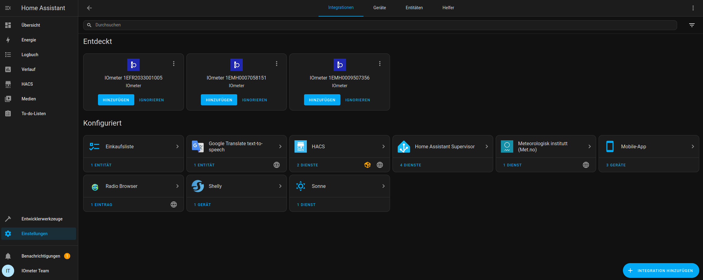
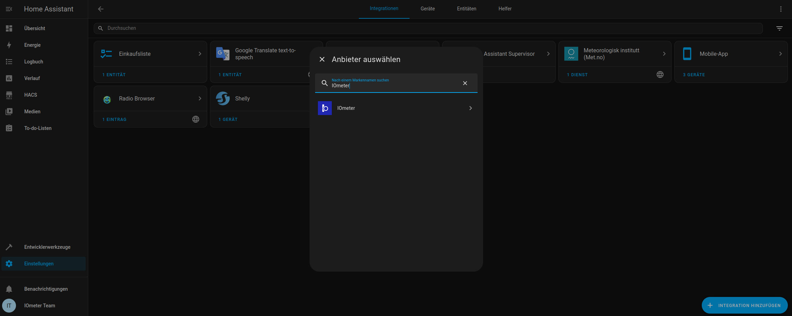
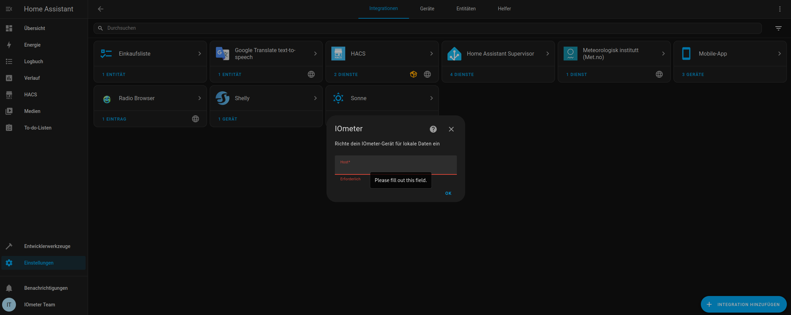
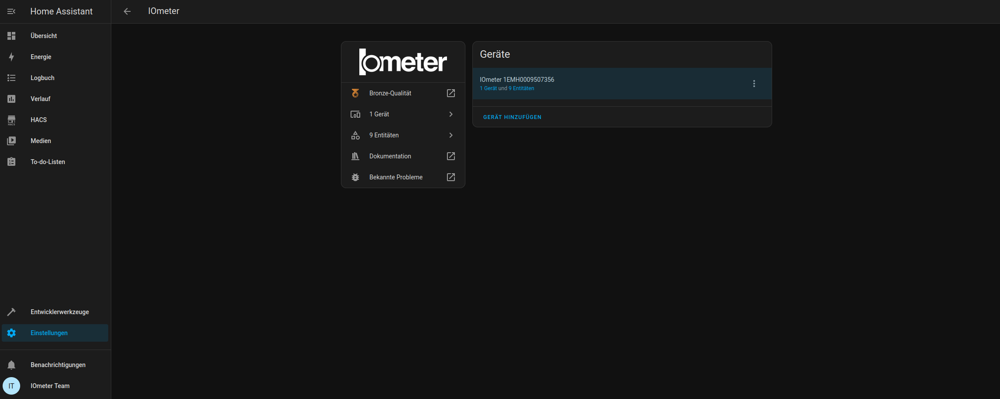
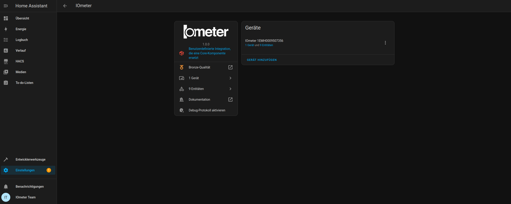
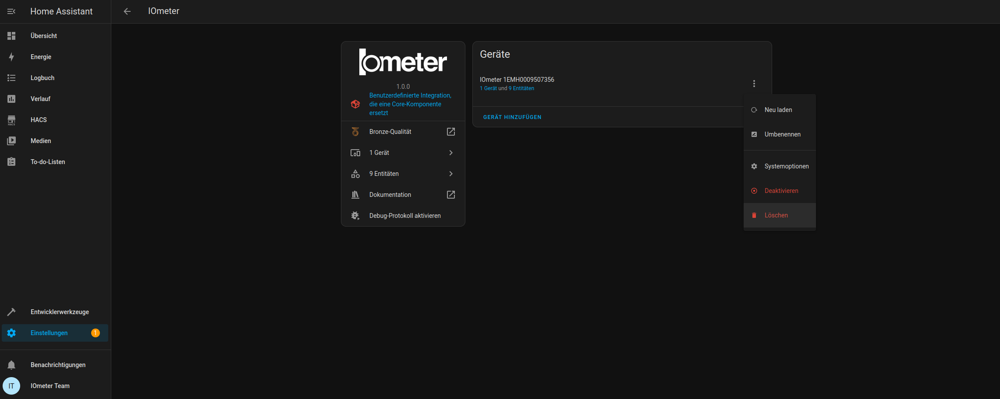
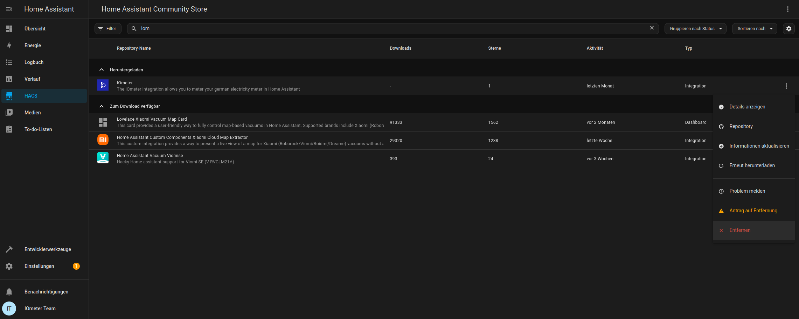

# Home Assistant

Ab sofort ist IOmeter als Integration in Home Assistant verfügbar! Mehr Informationen zur Integration findest du [hier.](https://www.home-assistant.io/integrations/iometer/)

## Verfügbarkeit von Home Assistant

### Bestandskunden

Bist du ein Bestandskunde, kannst du ab sofort das Home Assistant Feature für einmalig 19,90 Euro bei uns [IOmeter Upgrade - Lokale Daten](https://shop.iometer.de/products/home-assistant-integration-fur-altkunden) erwerben.

### Einzelhändler Kunde

Bestimmte Einzelhändler (z. B. ELV, Amazon) sowie [unser eigener IOmeter Shop](https://shop.iometer.de/products/iometer-plug-und-play-smart-meter-fuer-die-moderne-messeinrichtung) bieten IOmeter ab Mitte Februar bereits **inklusive einer Home Assistant-Lizenz** an. In diesem Fall kannst du direkt loslegen.

## Wie installierst du die IOmeter Integration in Home Assistant?

:::info
Stelle sicher, dass deine Home Assistant Installation mindestens die Version 2025.3 hat.
:::

Wenn dein Netzwerk/WLAN dies unterstützt, wird dein IOmeter automatisch erkannt. Du bekommst dann eine Benachrichtigung. Du kannst dann dein IOmeter unter **Einstellungen -> Geräte & Dienste** konfigurieren. Wähle dann **Hinzufügen** für dein IOmeter aus.

Sollte dies nicht der Fall sein, dann benutze den Button **Integration Hinzufügen** unten rechts in den **Geräte &** **Dienste** Einstellungen und suche nach **IOmeter**. Hierzu benötigst du die IP Adresse deines IOmeter. Diese kannst du üblicherweise in deinem Router herausfinden.

Gib dann die IP Adresse deines IOmeter an.

Anschließend wähle einen Bereich für dein IOmeter aus. Jetzt ist dein IOmeter erfolgreich in Home Assistant eingebunden.

## Du hast bereits die IOmeter Integration über den HACS installiert?
:::warning
Du kannst die HACS Version der Integration weiterverwenden, wir werden hierfür **keine** Updates zur Verfügung stellen.
::::

Wenn du bereits vor dem Release 2025.3 dein IOmeter in Home Assistant verwendet hast, dann hast du die IOmeter Integration über den **Home Assistant Community Store**, kurz HACS, installiert. Das erkennst du daran, dass dir Home Assistant ab dem Update 2025.3 eine rote Box mit einer Bemerkung in deinen Integrationseinstellung anzeigt.

Um die native Integration zu verwenden, deinstalliere die HACS Version der Integration. Dazu entfernst du alle eingebundenen IOmeter Geräte.

:::info
Achtung deine Daten in Home Assistant gehen **NICHT** verloren.
:::

Danach entfernst du die IOmeter Integration aus dem HACS.

Danach installierst du die IOmeter Integration so wie [oben](homeassistant#wie-installierst-du-die-iometer-integration-in-home-assistant) beschrieben.